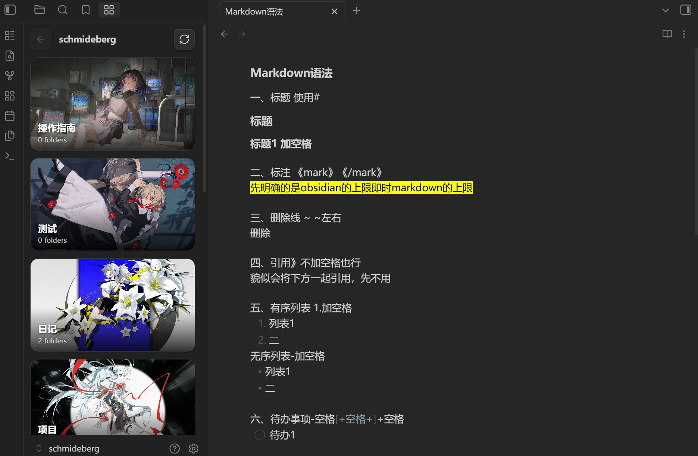

# Folder Cover Wall

By [Arebrodo](https://github.com/Arebrodo) · [中文说明](./README.zh-CN.md)

Folder Cover Wall turns Obsidian's left sidebar into a visual folder browser. Each folder is displayed as a large cover card, while notes and other files remain accessible inside the selected folder.



## Features

- Browse folders as large visual cover cards in the left sidebar.
- Navigate through nested folders without opening a separate dashboard in the main editor area.
- Keep notes and files accessible below the folder wall.
- Choose a cover image from anywhere inside the current vault.
- Choose an external image from elsewhere on the computer.
- Automatically use `cover.jpg`, `cover.png`, `.folder-cover.jpg`, and similar filenames.
- Optionally use the first image directly inside a folder as its cover.
- Use a generated fallback cover when no image is available.
- Configure root folder, card width, aspect ratio, folder/file counts, and file visibility.
- Preserve folder cover assignments when folders are renamed.
- Preserve nested folder covers when a parent folder is renamed.
- Manage copied external cover images from plugin settings.
- Remove unused external images and clean orphaned cover mappings.
- Reuse the same stored external image across multiple folders without duplicating it.
- Reduce cover-image memory use with optimized WebP thumbnails and lazy loading.

## Quick Start

After enabling the plugin, open **Folder Cover Wall** from the left sidebar or use the Command Palette.

Available commands:

- **Folder Cover Wall: Open Folder Cover Wall**
- **Folder Cover Wall: Replace current left sidebar view with Folder Cover Wall**
- **Folder Cover Wall: Manage external cover storage**
- **Folder Cover Wall: Optimize stored cover images**

You can also enable **Replace left pane automatically** in the plugin settings if you want Folder Cover Wall to open automatically.

### Browse folders

Click a folder card to enter that folder.

Use the back button or the folder title at the top to return to a parent folder.

Notes and other files inside the selected folder remain available below the folder cards.

### Set a folder cover

Right-click a folder card and choose one of the following:

- **Choose cover from vault…** — use an image already stored inside the vault.
- **Choose external image…** — select an image from anywhere on your computer.
- **Clear custom cover** — remove the assigned custom cover and return to automatic cover selection.

### Automatic cover priority

Folder Cover Wall chooses a cover in this order:

1. Manually selected external or vault image.
2. A configured cover filename such as `cover.jpg`, `cover.png`, `.folder-cover.jpg`, or `.folder-cover.png`.
3. The first image directly inside the folder, if enabled.
4. A generated fallback cover.

## Performance and memory use

**v0.6.1:** fixes duplicate Folder Cover Wall sidebar tabs that could accumulate after repeated restarts. Existing duplicates are cleaned automatically on the next startup.


Version 0.6.0 introduces a lower-memory cover pipeline designed for large image libraries.

- External images are reduced to a configurable maximum resolution and converted to WebP before being stored.
- Vault images can be rendered through temporary low-resolution WebP thumbnails without modifying the original files.
- Cover images are prepared only when their cards are near the visible area.
- Thumbnail generation is concurrency-limited to reduce temporary memory spikes.
- A small bounded thumbnail cache is used instead of keeping an unlimited number of decoded cover images alive.
- Cover image elements are released when the folder wall refreshes or closes.

Default performance settings are designed for the sidebar and can be adjusted under **Settings → Folder Cover Wall → Performance**.

Existing external cover images from earlier versions are automatically optimized when v0.6.0 is loaded for the first time.

## Rename-safe covers

Custom cover assignments automatically follow renamed folders.

If a parent folder is renamed, cover assignments for nested folders are migrated as well.

This prevents old folder paths from leaving behind unused cover mappings.

## External Cover Storage

External images selected from outside the vault are copied into the plugin's internal cover library so they remain available even if the original image is moved, renamed, disconnected, or deleted.

Open:

**Settings → Folder Cover Wall → External cover storage → Manage**

or run:

**Folder Cover Wall: Manage external cover storage**

The storage manager lets you:

- See how many external images are stored.
- See the total embedded storage size.
- See which folders use each image.
- See optimized cover dimensions and source/storage sizes.
- Optimize stored images for the current performance settings.
- Remove individual stored images.
- Remove unused external images.
- Clean orphaned folder-cover mappings.
- Remove all externally stored cover images.

The same external image is stored only once, even when it is used by multiple folders.

## External images and privacy

External images are read locally. The optimized cover copy is stored as embedded image data in the plugin's `data.json`.

The plugin does **not** upload external images anywhere.

Because a local optimized copy is stored, moving or renaming the original image does not break the folder cover.

The original source image is not modified.

## Settings

Folder Cover Wall includes options for:

- Root folder
- Card minimum width
- Card aspect ratio
- Folder counts
- File counts
- File visibility
- Automatic use of the first image in a folder
- Automatic left sidebar replacement
- Maximum cover resolution
- WebP cover quality
- Temporary optimization of vault cover images
- Lazy loading of cover images
- External cover storage management

## Installation

### Community Plugins

After the plugin is available in the Community Plugins directory:

1. Open **Settings → Community plugins → Browse**.
2. Search for **Folder Cover Wall**.
3. Install and enable it.

### Manual installation

Copy the following files into:

```text
<Vault>/.obsidian/plugins/folder-cover-wall/
```

Required files:

```text
main.js
manifest.json
styles.css
```

Reload Obsidian, then enable **Folder Cover Wall** under Community plugins.

## Why I made this

I built Folder Cover Wall with the help of GPT because I wanted a more visual and expressive way to browse folders — something closer to the polished, cover-based folder experience found in apps like Craft.

I personally enjoy interfaces where folders feel less like plain lists and more like visual spaces. Since I could not find an existing plugin that matched exactly what I wanted, I used GPT to help turn the idea into a working plugin.

I'm sharing it for others who also enjoy a more colorful, visual, and "fancy" way to organize their workspace.

Feedback, ideas, and bug reports are very welcome.

## Development

Requirements:

- Node.js 18 or newer
- npm

Install dependencies:

```bash
npm install
```

Start a development build:

```bash
npm run dev
```

Create a production build:

```bash
npm run build
```

The production build outputs `main.js` in the repository root.

## Repository

GitHub: https://github.com/Arebrodo/folder-cover-wall

Issues: https://github.com/Arebrodo/folder-cover-wall/issues

## Releasing

See [RELEASING.md](./RELEASING.md).

The repository includes a GitHub Actions workflow that can create a release automatically when you push a version tag such as:

```text
0.6.0
```

## License

MIT. See [LICENSE](./LICENSE).
